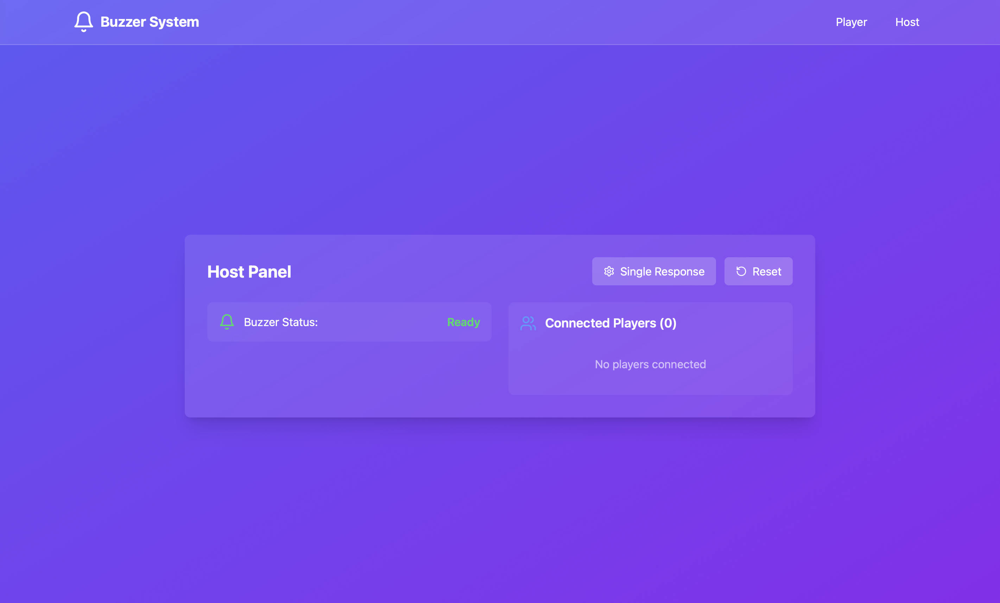

# Real-time Buzzer System


A real-time buzzer system built with React, Socket.IO, and Express for interactive quiz games or competitions. The system allows multiple players to compete by buzzing in, with a host controlling the game flow.

## Features

- **Real-time Interaction**: Instant buzzer response using WebSocket technology
- **Two Game Modes**:
  - Single Mode: Only the first player to buzz in is recorded
  - Multiple Mode: Records all player responses in order
- **Host Controls**:
  - Reset buzzer
  - Switch between game modes
  - View all connected players
  - Monitor response times with millisecond precision
- **Player Features**:
  - Custom player names
  - Visual and audio feedback when buzzing
  - Real-time status updates
  - Response time tracking

## Technology Stack

- Frontend:
  - React
  - TypeScript
  - Vite (build tool)
  - Socket.IO Client
  - Lucide React (icons)
- Backend:
  - Express.js
  - Socket.IO
  - Node.js

## Getting Started

1. Install dependencies:
```bash
npm install
```

2. Start the development server:
```bash
npm run dev
```

This will start both the Vite development server for the frontend and the Express server for WebSocket communication.

## Usage

### As a Host
1. Navigate to the host view
2. Monitor connected players
3. Control game mode (single/multiple)
4. Reset the buzzer between questions
5. View response times and order

### As a Player
1. Enter your name to join
2. Wait for the host to reset the buzzer
3. Click the buzzer button to respond
4. See who buzzed in first and response times

## Development

The project uses:
- TypeScript for type safety
- Vite for fast development and building
- Concurrent running of frontend and backend servers
- Socket.IO for real-time bidirectional communication

## Project Structure

- `/src` - Frontend React application
  - `/components` - React components (HostView, PlayerView)
  - `/types` - TypeScript type definitions
- `/server` - Backend Express and Socket.IO server
- `/public` - Static assets

## Contributing

Feel free to submit issues and enhancement requests!

## Screenshots

### Host View

